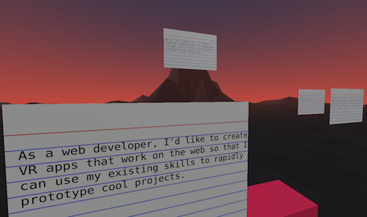

# aframe-notecards
## Notecards in VR for brainstorming and processing your thoughts

  

Try it out now: https://kfarr.github.io/aframe-notecards/

This app takes a Google Sheet with a column named "Idea" and creates virtual notecards randomly placed in a scene. Using the Vive controls you can grab and move the cards around to organize them around common themes. You can still use this without a Vive, but you won't be able to move the cards around.

This is an experimental app to solve my own problem. As a product manager we have hundreds of pieces of feedback from employees and customers, and I'd like to be able to take them from a spreadsheet and then arrange them "virtually" around common themes. Right now I do this in meatspace using cut up printouts taped to white boards. I thought it'd be fun to make a VR version with A-Frame and the HTC Vive controls.

## How to use:
* Copy this Google Sheet to your own Google Apps account: https://docs.google.com/spreadsheets/d/1FdjSF9zsBiOJYf40hqDXRfEbqZ7nveMP0t6nN86rLNU/edit?usp=sharing
* Replace the examples with your own ideas
* Make sure the Google Sheet is "published": click on File > Publish to the Web... > Publish
* Edit index.html to point to the new path of your own Google Sheet
* Fire up your favorite webserver
* Load the page with a webvr compatible browser and your HTC Vive
* Enter VR and organize your thoughts

## Known issues / to-do items:
* Add ability to create "theme labels" using https://github.com/ngokevin/kframe/tree/master/components/text. During the feedback parsing process it can be helpful to place the notecards around the common theme labels.
* The aframe text component (https://github.com/bryik/aframe-bmfont-text-component) looks blurry and aliased with small text in the distance, such as this very use case. Rendering text to an image texture results in higher quality text but is not nearly as easy as using the text component when using dynamic sources such as Google Sheets. The "real" solution is to improve the quality of the BMFont a-frame component. It may be possible to "re-render" a font with settings optimized for viewing from a distance or to improve the BMFont shader. More reading on this topic:
** https://github.com/Jam3/three-bmfont-text
** http://www.valvesoftware.com/publications/2007/SIGGRAPH2007_AlphaTestedMagnification.pdf
** https://github.com/libgdx/libgdx/wiki/Distance-field-fonts
* My javascript sucks but it gets the job done
* UI to allow for end-user to copy/paste google sheet URL before entering VR mode
* Better error handling when Google Sheet cannot be parsed
* Would be nice to save the location of the cards for future sessions
* Would be nice to have collaboration features to work remotely with a colleague
* If we have "theme labels" it'd be cool to retractively update the Google Sheet so that each Idea row has a new column "Theme" populated by the theme label with the closet proximity to the notecard. Then your work in VR can update the sheet itself.
